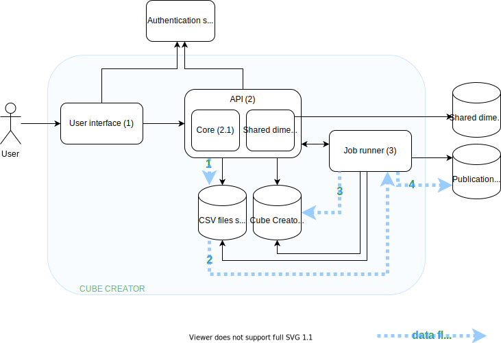

# High-level system architecture

## 1. User interface

SPA built with [vue.js](https://vuejs.org)

Code: [ui](../ui)

## 2. API

[Hydra](https://www.hydra-cg.com/) HTTP API

Code: [apis](../apis)

### 2.1 API Core

Code: [apis/core](../apis/core)

### 2.2 API Shared dimensions

Code: [apis/shared-dimensions](../apis/shared-dimensions)

## 3. Job runner

Runs data processing pipelines built with [barnard59](https://github.com/zazuko/barnard59)

Code: [cli](../cli)

## 4. Stores

Cube Creator reads/writes from/to multiple RDF triplestores.

### 4.1 Cube Creator store

Contains data that is specific to Cube Creator. Requires the ability to create/delete named graphs.

### 4.2 Publication store

Published Cubes are sent to the Publication store, in a specified named graph.

### 4.3 Shared dimensions store

Contains data about Shared dimensions.

### 4.4 CSV files storage

CSV files are stored in an S3-compatible storage.

## 5. Authentication service

...
